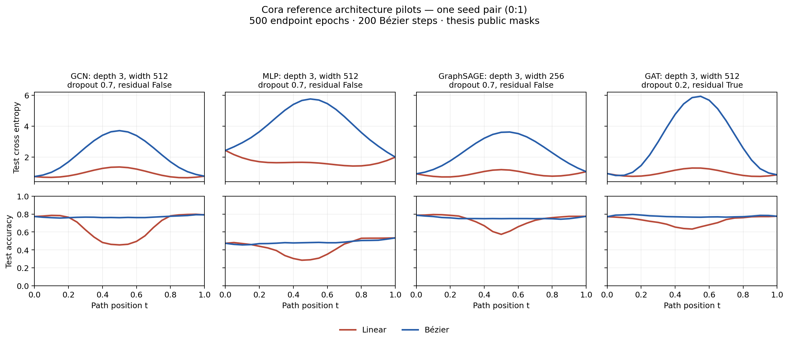

# Reference architecture baselines

Historical pilot snapshot. The later [full reference matrix](../../docs/reference_full_results.md)
covers all 16 configurations with three pairs each; endpoint-only Optuna tuning
is described in [onboarding](../../ONBOARDING.md#tune-and-cache-endpoint-hyperparameters).

Completed 2026-09-18: one Cora endpoint pair for each architecture, using the
reference endpoint budget and the existing thesis loader. These are initial
comparisons, not the paper's three-repeat numerical reproduction.



| Model | Mean endpoint test accuracy | Linear test loss barrier | Bézier test loss barrier | Detailed plots |
|---|---:|---:|---:|---|
| GCN | 78.25% | 0.606370 | 2.957055 | [PNG](Cora/gcn/connectivity.png), [PDF](Cora/gcn/connectivity.pdf) |
| MLP | 50.40% | 0 | 3.546112 | [PNG](Cora/mlp/connectivity.png), [PDF](Cora/mlp/connectivity.pdf) |
| GraphSAGE | 78.10% | 0.201023 | 2.627446 | [PNG](Cora/graphsage/connectivity.png), [PDF](Cora/graphsage/connectivity.pdf) |
| GAT | 77.35% | 0.398691 | 5.040358 | [PNG](Cora/gat/connectivity.png), [PDF](Cora/gat/connectivity.pdf) |

All four Bézier training-loss barriers are zero on the sampled grid. Their
validation/test loss barriers are higher than linear interpolation, although
Bézier test accuracy stays relatively flat. This is consistent with excessive
confidence on held-out mistakes. The current curve settings need investigation
using training/validation data before drawing conclusions about the paper's
test-loss findings or extending REPAIR.

Each run uses seeds `0:1`, 500 endpoint epochs, validation-accuracy selection,
200 Bézier Adam steps at learning rate 0.01, and 21 evaluation points. Cora keeps
the thesis public masks (140/500/1000 labeled nodes). Model settings come from
pinned tunedGNN; the MLP uses the GCN profile with linear blocks. The paper's
exact MLP, curve optimizer, normalization policy, and splits remain unrecovered.
See [source provenance](../../docs/architecture_sources.md) and
[verification](../../docs/architecture_verification.md).

The [smoke summary](smoke_summary.json) covers all 16 combinations of the four
architectures and Cora, Roman-empire, squirrel, and chameleon. Smoke runs use
width 8 and five training steps; their metrics are workflow checks only.

Reports and figures are tracked here; weights remain in the ignored local
`runs/reference-cora-20260918/` and `runs/reference-smoke-20260918/` directories.
Checkpoint paths inside the copied reports are relative to the original run
directory, not this snapshot. No REPAIR was applied to these reference models.

Regenerate this overview with:

```bash
python results/reference-architectures/plot_cora.py
```

Deferred: three independent pairs, full-budget runs on the other three datasets,
curve-training choices based on validation data, and any new REPAIR adapters.
