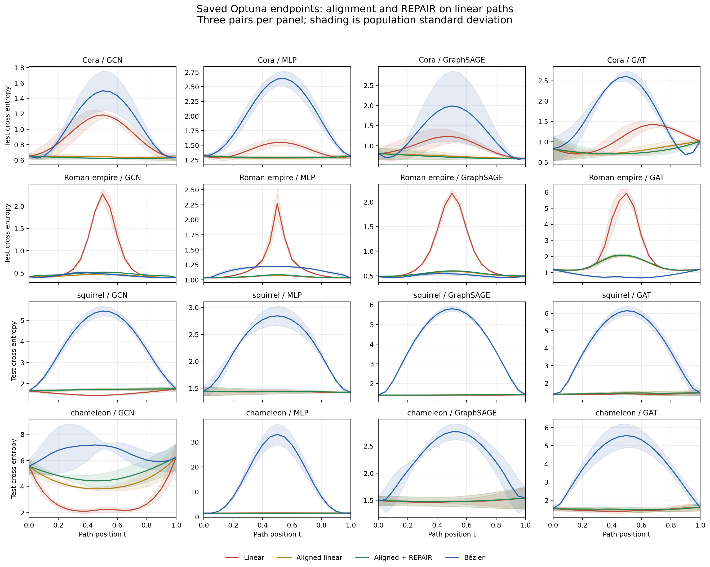
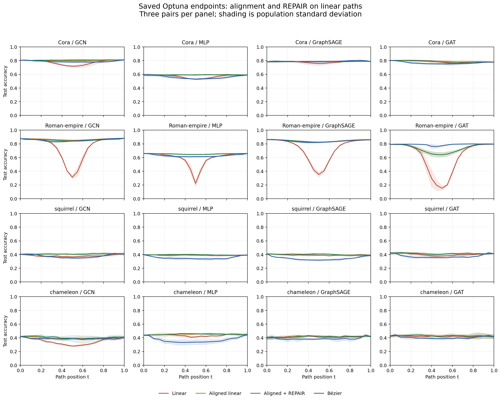

# Alignment and REPAIR on tuned endpoints

All four architectures and datasets, three saved endpoint pairs per configuration. Each pair compares the same two endpoints and its original Bézier curve. No endpoint training, Optuna search or curve fitting occurred in this analysis.

Mean sampled test cross-entropy barriers across three pairs:

| Dataset | Model | Linear | Aligned | Aligned + REPAIR | Bézier |
|---|---|---:|---:|---:|---:|
| Cora | GCN | 0.5587 | 0.0093 | 0.0000 | 0.8582 |
| Cora | MLP | 0.2393 | 0.0008 | 0.0000 | 1.3410 |
| Cora | GraphSAGE | 0.4922 | 0.0131 | 0.0000 | 1.2429 |
| Cora | GAT | 0.4998 | 0.0190 | 0.0000 | 1.6889 |
| Roman-empire | GCN | 1.8680 | 0.0678 | 0.1094 | 0.0949 |
| Roman-empire | MLP | 1.2359 | 0.0461 | 0.0524 | 0.1916 |
| Roman-empire | GraphSAGE | 1.6835 | 0.0977 | 0.1084 | 0.0536 |
| Roman-empire | GAT | 4.7669 | 0.8652 | 0.8940 | 0.0000 |
| squirrel | GCN | 0.0000 | 0.0291 | 0.0343 | 3.7397 |
| squirrel | MLP | 0.0208 | 0.0065 | 0.0061 | 1.4105 |
| squirrel | GraphSAGE | 0.0049 | 0.0034 | 0.0023 | 4.3875 |
| squirrel | GAT | 0.0318 | 0.0417 | 0.0434 | 4.7488 |
| chameleon | GCN | 0.0000 | 0.0000 | 0.0000 | 1.8331 |
| chameleon | MLP | 0.0761 | 0.0007 | 0.0000 | 31.6119 |
| chameleon | GraphSAGE | 0.0331 | 0.0033 | 0.0034 | 1.2505 |
| chameleon | GAT | 0.0164 | 0.0000 | 0.0026 | 3.9959 |

Per-model folders contain labeled train/validation/test plots and full reports. The original models, tuning provenance and source report hashes identify the reused endpoints.

Alignment uses training-node correlations and checks endpoint logit invariance. REPAIR uses training-node moments after complete blocks, with inherited full-graph BatchNorm calibration frozen before correction. It matches weighted endpoint means and standard deviations sequentially; Bézier remains unchanged. The repaired path is not a straight parameter line.

All 48 repaired midpoint checkpoints were reloaded on the GPU that ran their analysis. The audit verifies source curves, finite metrics, pair/grid identity and midpoint replay. Weights remain in the ignored local run directory; reports and graphics are tracked.
