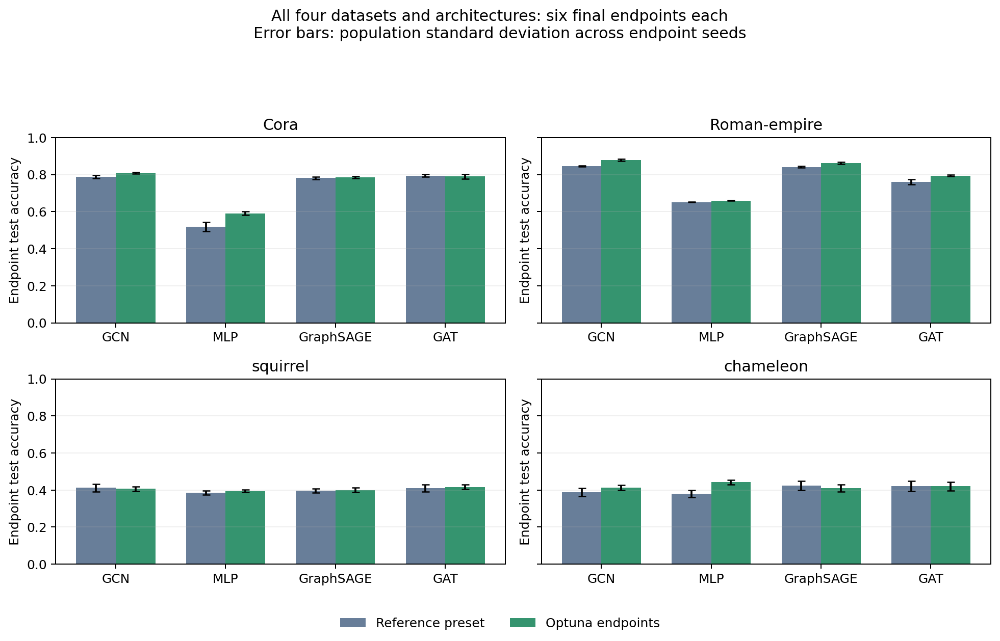

# Tuned endpoint results

Optuna endpoint tuning only; three independent final pairs; fixed Bézier settings.

Twenty total Optuna trials per configuration, including pruned trials; tuning seed 42. Selected configurations maximize validation accuracy. Final seeds 0–5 are independent of tuning. The thesis loader/masks and reference endpoint epoch budgets are retained.

| Dataset | Model | Fixed / tuned endpoint test accuracy | Linear / Bézier test barrier | Selected width / depth |
|---|---|---:|---:|---:|
| Cora | GCN | 0.788 / 0.808 | 0.559 / 0.858 | 512 / 2 |
| Cora | MLP | 0.518 / 0.591 | 0.239 / 1.341 | 512 / 2 |
| Cora | GraphSAGE | 0.782 / 0.786 | 0.492 / 1.243 | 512 / 2 |
| Cora | GAT | 0.795 / 0.791 | 0.500 / 1.689 | 256 / 2 |
| Roman-empire | GCN | 0.846 / 0.879 | 1.868 / 0.095 | 128 / 4 |
| Roman-empire | MLP | 0.652 / 0.660 | 1.236 / 0.192 | 512 / 9 |
| Roman-empire | GraphSAGE | 0.841 / 0.862 | 1.683 / 0.054 | 128 / 4 |
| Roman-empire | GAT | 0.761 / 0.795 | 4.767 / 0.000 | 128 / 10 |
| squirrel | GCN | 0.412 / 0.407 | 0.000 / 3.740 | 128 / 4 |
| squirrel | MLP | 0.386 / 0.395 | 0.021 / 1.410 | 32 / 3 |
| squirrel | GraphSAGE | 0.397 / 0.400 | 0.005 / 4.387 | 128 / 3 |
| squirrel | GAT | 0.412 / 0.416 | 0.032 / 4.749 | 256 / 4 |
| chameleon | GCN | 0.389 / 0.414 | 0.000 / 1.833 | 256 / 5 |
| chameleon | MLP | 0.380 / 0.443 | 0.076 / 31.612 | 128 / 3 |
| chameleon | GraphSAGE | 0.424 / 0.410 | 0.033 / 1.250 | 32 / 3 |
| chameleon | GAT | 0.421 / 0.420 | 0.016 / 3.996 | 512 / 3 |

Each dataset/model folder contains the report, cached best parameters, and labeled PNG/PDF path plots. Raw model checkpoints and SQLite studies stay in the local ignored `runs/` directories.

This is a bounded validation search, not proof of globally optimal hyperparameters or an exact numerical paper reproduction. Bézier fitting was not tuned. Test metrics were used only for this final comparison.

The audit checks reports against persisted Optuna studies, source budgets, data identities, and endpoint/path boundary metrics. It does not retrain models or replay every checkpoint.
